# nonebot-plugin-petpet

[Nonebot2](https://github.com/nonebot/nonebot2) 插件，制作头像相关的表情包

### 使用

发送“头像表情包”显示下图的列表：

  

每个表情包首次使用时会下载对应的图片和字体，可以手动下载 `resources` 下的 `images` 和 `fonts` 文件夹，放置于机器人运行目录下的 `data/petpet/` 文件夹中

#### 触发方式
- 指令 + @user，如： /爬 @小Q
- 指令 + qq号，如：/爬 123456
- 指令 + 自己，如：/爬 自己
- 指令 + 图片，如：/爬 [图片]

前三种触发方式会使用目标qq的头像作为图片

#### 支持的指令

- 摸

  

- 亲

  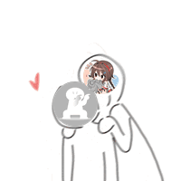

- 贴/蹭

  

- 顶/玩

  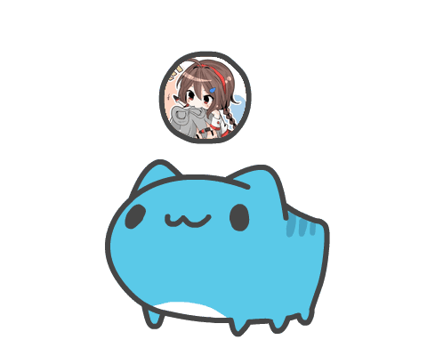

- 拍

  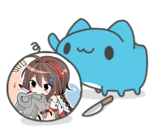

- 撕

  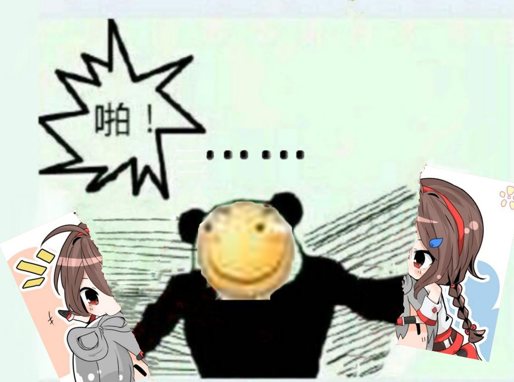

- 丢

  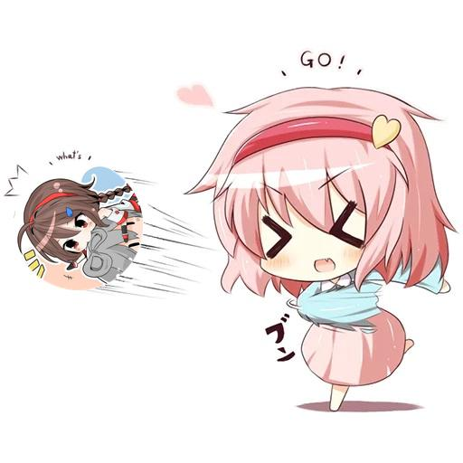

- 爬

  

- 精神支柱

  

- 一直

  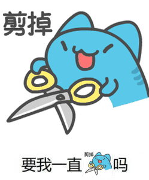

- 加载中

  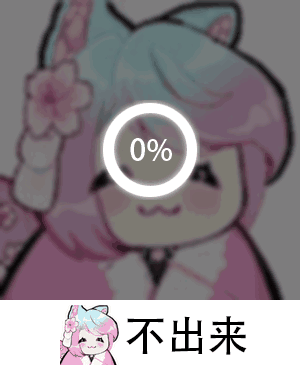

- 转

  

- 小天使

  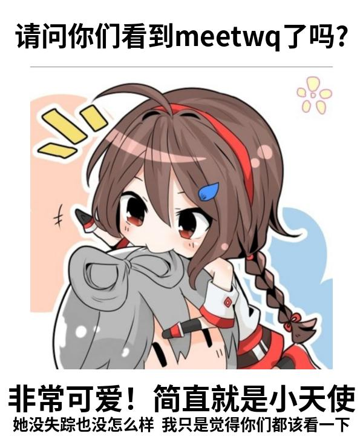

- 不要靠近

  

- 一样

  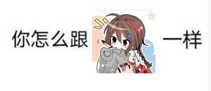

- 滚

  

- 玩游戏

  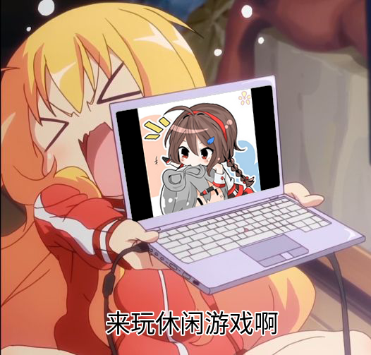

- 膜

  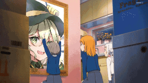

